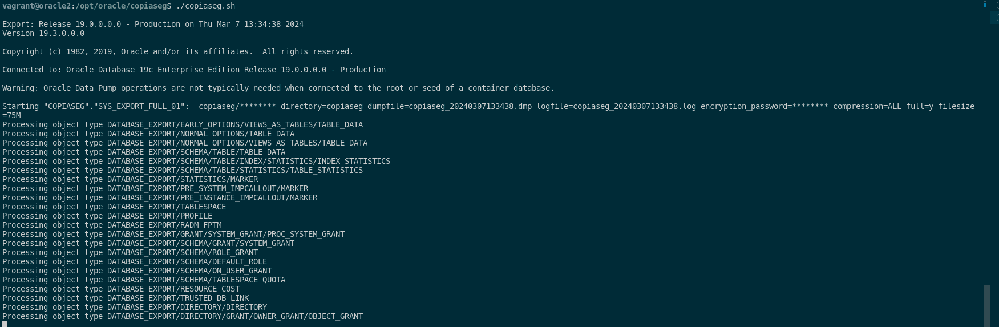
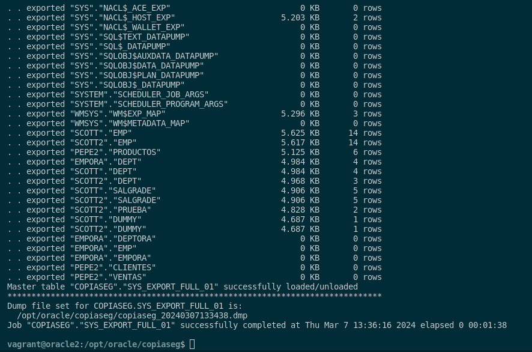
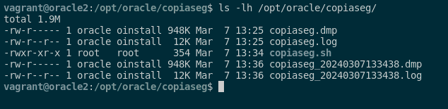

### 1. Realiza una copia de seguridad lógica de tu base de datos completa, teniendo en cuenta los siguientes requisitos:

### ▪ La copia debe estar encriptada y comprimida.
### ▪ Debe realizarse en un conjunto de ficheros con un tamaño máximo de 75 MB.
### ▪ Programa la operación para que se repita cada día a una hora determinada.

Para poder realizar la copia seguridad lógica de mi base de datos completa de Oracle, tendremos que tener en cuenta los permisos de ella misma, es decir, que los usuarios administradores tengan permiso a realizar copias de seguiridad.

Yo para segmentar el trababajo a la hora de realizar la práctica, voy a crear un usuario con rol como DBA para que pueda realizar las copias de seguridad. Para realizar esto, ejecutaremos los siguientes comandos:

```sql
alter session set "_ORACLE_SCRIPT"=true;

CREATE USER copiaseg IDENTIFIED BY copiaseg;
GRANT CONNECT, RESOURCE, DBA TO copiaseg;
ALTER USER copiaseg ACCOUNT UNLOCK;
```

Seguido de esto, crearemos un directorio como hicimos en la práctica movimiento de datos. Tenemos que tener cuidado y darle los permisos para poder realizar copias de seguridad al usuario copiaseg. Esto lo haremos mediante estos comandos:

```sql
sudo mkdir /opt/oracle/copiaseg
sudo chown -R oracle:oinstall /opt/oracle/copiaseg/
sqlplus / as sysdba
CREATE DIRECTORY copiaseg AS '/opt/oracle/copiaseg';
GRANT READ,WRITE ON DIRECTORY copiaseg TO copiaseg;
GRANT DATAPUMP_EXP_FULL_DATABASE TO copiaseg;
```

Seguido de esto, utilizaremos el siguiente script, en al cual vamos a realizar la copia de seguridad. Además en este apartado, especificaremos el tamaño máximo en el conjunto de ficheros de 75MB. ESte es el comando:

```sql
sudo nano /opt/oracle/copiaseg/copiaseg.sh

#!/bin/bash

FECHA=`date +%Y%m%d%H%M%S`
USER=copiaseg
PASSWORD=copiaseg
RUTA_COPIA=/opt/oracle/backups
DIRECTORY=copiaseg
NOMBRE_COPIA=copiaseg_$FECHA
FICHERO_COPIA=$RUTA_COPIA/$NOMBRE_COPIA

expdp $USER/$PASSWORD directory=$DIRECTORY dumpfile=$NOMBRE_COPIA.dmp logfile=$NOMBRE_COPIA.log encryption_password=$PASSWORD compression=ALL full=y filesize=75M
```

En la ejecución del comando **expdp**, tendremos que aplicar las siguientes opciones que son:

- **`COMPRESSION`**=ALL: Comprime la copia de seguridad.

- **`FULL`**=Y: Realiza una copia completa de la base de datos.

- **`FILESIZE=60M`**: Divide la copia en ficheros de 60MB.

- **`DUMPFILE`**: Nombre del fichero de copia.

- **`LOGFILE`**: Nombre del fichero de registro.

- **`ENCRYPTION_PASSWORD`**: Contraseña para encriptar la copia.

Seguido de esto, le damos permisos de ejecución para ejecutar el script y lo probamos con los siguientes comandos:

```sql
sudo chmod +x /opt/oracle/copiaseg/copiaseg.sh
cd /opt/oracle/copiaseg
./copiaseg.sh
```



...



Si queremos ver los logs de la copia de seguridad, ejecutaremos este comando:

```sql
ls -lh /opt/oracle/copiaseg/
```



Ahora programaremos la ejecución del script de copia de seguridad a una hora determinada cada día, en mi caso será a las 8 de la mañana. Para ello, usaré estso comandos

```sql
crontab -e
0 8 * * * /opt/oracle/copiaseg/copiaseg.sh
```

Con estos pasos, se realizará una copia de seguridad lógica de la base de datos ORACLE completa encriptada y comprimida, dividida en ficheros de 75MB.