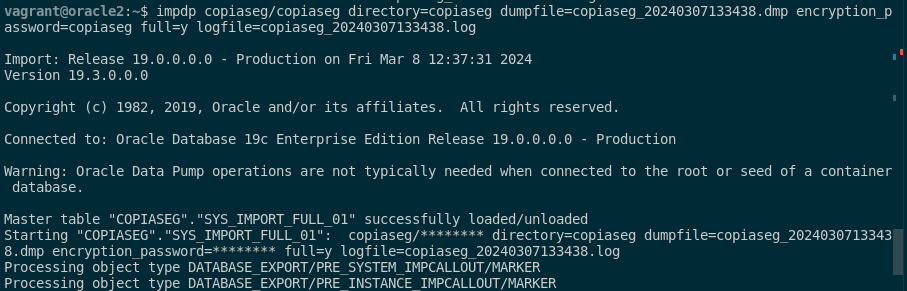
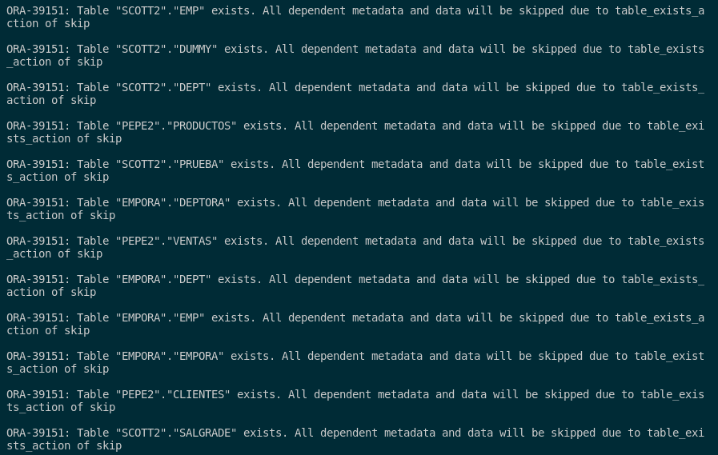
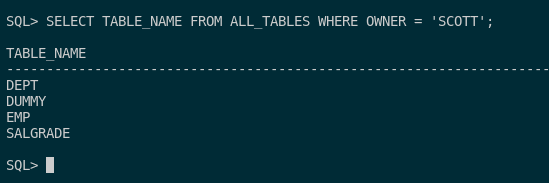

### 2. Restaura la copia de seguridad lógica creada en el punto anterior.

Para restaurar la copia de seguridad lógica creada en el punto anterior, primero eliminaré las tablas del usuario scott de la siguiente manera. Primero accedo al usuario, después cosultamos las tablas del usuario y por último borramos todas sus tablas.

```sql
alter session set "_ORACLE_SCRIPT"=true;
sqlplus scott/scott;

SELECT * FROM CAT;

DROP TABLE EMP;
DROP TABLE DEPT;
DROP TABLE SALGRADE;
DROP TABLE DUMMY;
```

Con los datos eliminados, pasamos a la importación de la base de datos con este comando:

```sql
impdp copiaseg/copiaseg directory=copiaseg dumpfile=copiaseg_20240307133438.dmp encryption_password=copiaseg full=y logfile=copiaseg_20240307133438.log
```



Habrá algunos datos que nos saldrán repetidos ya que no los hemos eliminado antes de importar la copia de seguridad y ya existían en la base de datos.



Si queremos ver los logs de este mismo tendremos que ejecutar el siguienet comando:

```sql
cat /opt/oracle/copiaseg/copiaseg_20240307133438.log
```

Si queremos ver si se ha importado de manera correcta, accedemos al usuario y realizamos la siguiente consulta:

```sql
sqlplus / as sysdba
SELECT TABLE_NAME FROM ALL_TABLES WHERE OWNER = 'SCOTT';
```



Como vemos, la base de datos ha sido restaurada de manera correcta.