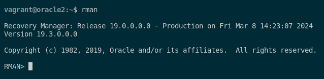

### 3. Pon tu base de datos en modo ArchiveLog y realiza con RMAN una copia de seguridad física en caliente.

Para poder poner la base de datos en modo ArchiveLog, tendremos que conectarnos como SYSDBA y ejecutar lo siguiente. Primero, paramos la base de datos, de seguido la arrancamos y por último, cambiamos el tipo de base de datos: 

```sql
sqlplus / as sysdba

shutdown immediate;
startup mount;
alter database archivelog;
alter database open;
```


Cuando ya tengamos la base de datos en ArchiveLog, lo comprobamos ejecutando esta consulta:

```sql
SELECT log_mode 
FROM V$DATABASE;
```


Tras esto, accederemos como SYSDBA y crearemos un usuario para la copia de seguridad respectiva.

```sql
sqlplus / as sysdba
alter session set "_ORACLE_SCRIPT"=true;

CREATE USER RMAN IDENTIFIED BY RMAN;
GRANT CONNECT, RESOURCE TO RMAN;
GRANT RECOVERY_CATALOG_OWNER TO RMAN;
```

Tras esto, creamos un tablespace para el usuario RMAN que hemos creado anteriormente:

```sql
CREATE TABLESPACE TS_RMAN DATAFILE '/opt/oracle/oradata/ORCLCDB/ts_rman.dbf' SIZE 300M AUTOEXTEND ON NEXT 10M MAXSIZE UNLIMITED;
ALTER USER RMAN DEFAULT TABLESPACE TS_RMAN QUOTA UNLIMITED ON TS_RMAN;
```

Tras esto, pasamos a la conguración de rman. Para poder realizar la copia mediante rman tendremos que ejecutar el comando en la terminal:

```sql
rman
```



Seguido de esto, deberemos contectarnos a la base de datos mediante el usuario que creamos anteriormente.

```sql
CONNECT CATALOG RMAN/RMAN
```


Ya dentro, vamos a tener que crear el catálogo a partir del tablespace que hemos creado anteriormente. Esto lo crearemos mediante este comando:

```sql
CREATE CATALOG TABLESPACE TS_RMAN;
```


Tras esto, ya podremos conectarnos al catálogo de RMAN y lo haremos mediante el siguiente comando desde la terminal y nos registramos:

```sql
rman target =/ catalog RMAN/RMAN
REGISTER DATABASE;
```


Habiendonos registrado ya con el usuario RMAN, pasamos a crear la copia de seguridad en caliente con el siguiente comando:

```sql
BACKUP DATABASE PLUS ARCHIVELOG;
```


Para verificar que la copia de seguridad se ha realizado correctamente. Podemos hacerlo mediante el siguiente comando en RMAN:

```sql
RESTORE DATABASE PREVIEW;
```


Y con esto, hemos conseguido configurar la base de datos en modo ArchiveLog y hemos realizado al copia de la base de datos en caliente mediante RMAN.