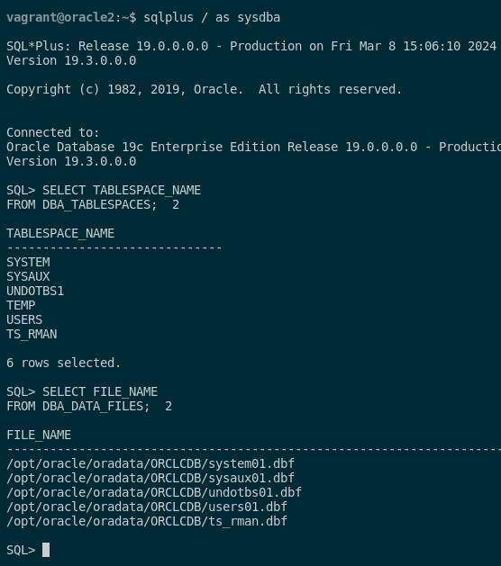
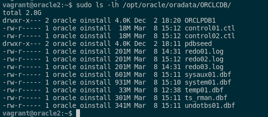
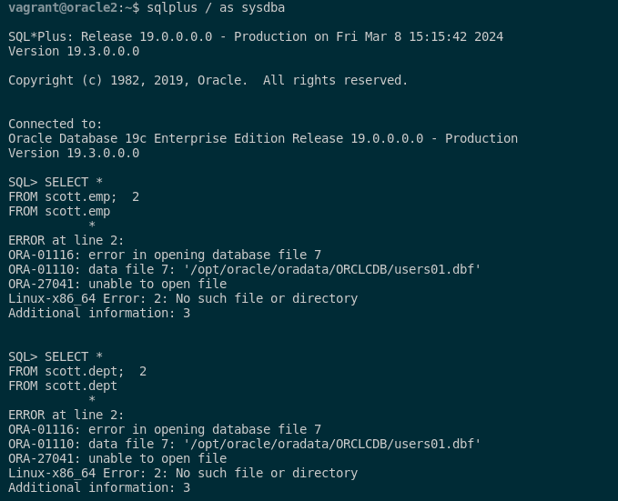
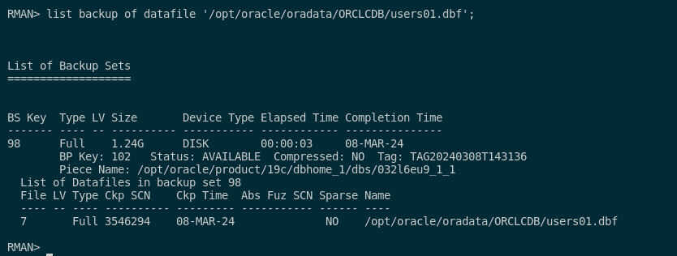
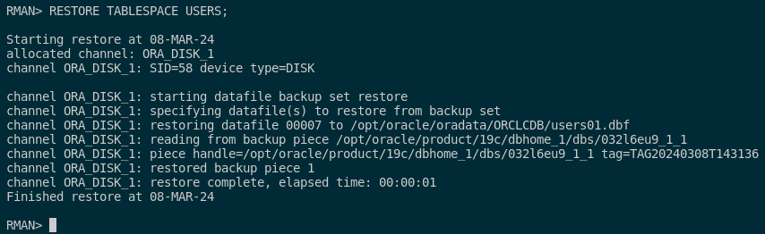
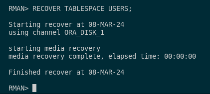
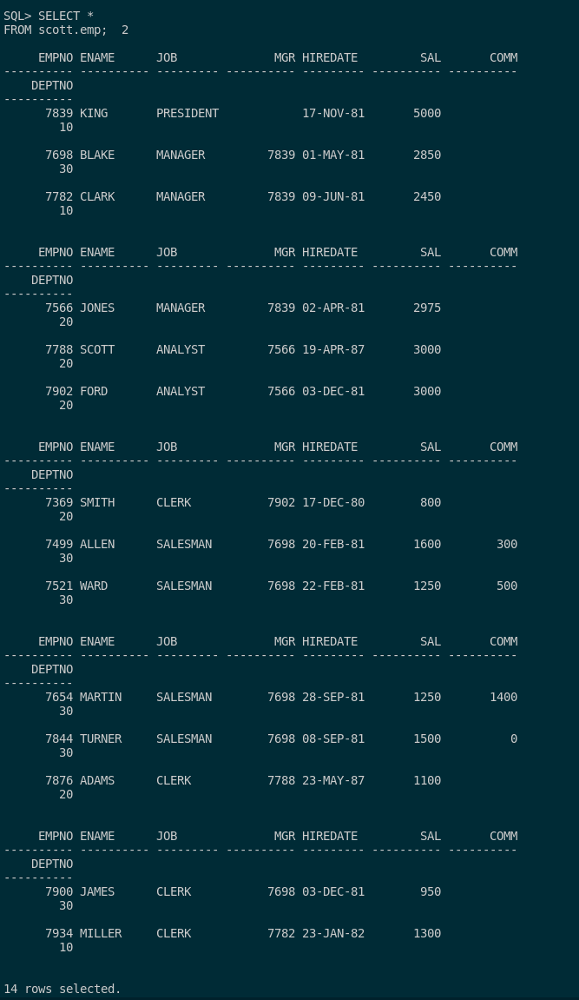
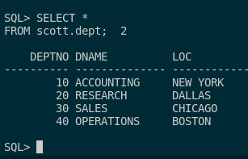
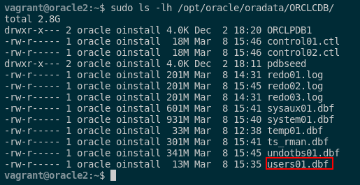

### 4. Borra un fichero de datos de un tablespace e intenta recuperar la instancia de la base de datos a partir de la copia de seguridad creada en el punto anterior.

Para realizar la restauración de un fichero de un tablespace de la base de datos, eliminaré el fichero de tablespace de USERS. Para poder hacer esto, tendremos que acceder como SYSDBA y hacer las siguientes consultas para ver todos los tablespace de la base de datos y otra para ver los fichero de los tablespace:

```sql
sqlplus / as sysdba

SELECT TABLESPACE_NAME 
FROM DBA_TABLESPACES;

SELECT FILE_NAME 
FROM DBA_DATA_FILES;
```



Tras verlo, pasamos a eliminar el tablespace USERS que he comentado anteriormente. Primero copio el fichero que vamos a eliminar que es users01.dbf al directorio donde tengo las copias de seguridad y seguido de esto, eliminamos el archivo. Los comandos son los siguientes:

```sql
mkdir copia_rman
sudo cp /opt/oracle/oradata/ORCLCDB/users01.dbf copia_rman/
sudo rm /opt/oracle/oradata/ORCLCDB/users01.dbf 
```

Si queremos ver si se ha borrado correctamente ejecutamos el siguiente comando:

```sql
sudo ls -lh /opt/oracle/oradata/ORCLCDB/
```



Para comprobar si los datos se han borrado correctamente, accederemos como SYSDBA y realizaremos esta consulta para ver si las tablas DEPT y EMP del usuario scott no existen.

```sql
sqlplus / as sysdba

SELECT * 
FROM scott.emp;

SELECT * 
FROM scott.dept;
```



Como vemos, nos da un fallo ya que no encunetra el archivo y esto es por la eliminación anterior que hemos realizado.

Tras esto, nos conectaremos a RMAN como hemos hecho anteriormente y restauraremos la base de datos a partir de la copia de seguridad. Accederemos mediante este comando:

```sql
rman target =/ catalog RMAN/RMAN
```

Seguido de esto, pasamos a ver si el fichero del tablespace eliminado existe en la copia de seguridad. Para ello, podemos ejecutar el siguiente comando:

```sql
list backup of datafile '/opt/oracle/oradata/ORCLCDB/users01.dbf';
```



Como podemos ver el archivo que hemos eliminado existe en la copia de seguridad en caliente que hicimos en el ejercicio anterior. Por ello, para restaurar este archivo que hemos eliminado tendremos que seguir los siguientes pasos:

Primero, tendremos que poner OFFLINE el tablespace USERS que es el que vamos a restaurar

```sql
SQL "ALTER TABLESPACE USERS OFFLINE IMMEDIATE";
```

Cuando esté desactivado, restauramos el archivo mediante la copia de seguridad que hicimos con estos comandos:

```sql
RESTORE TABLESPACE USERS;
```



```sql
RECOVER TABLESPACE USERS;
```



Por último, volveremos a activar dicho tablespace con este comando para poder tener todos los datos importados correctamente:

```sql
SQL "ALTER TABLESPACE USERS ONLINE";
```

Ya tendríamos restaurado el archivo users01.dbf que eliminamos al principio del ejercicio. Para comprobar que se ha restaurado correctamente lo podremos ver de 2 maneras:

- Podemos acceder a la base de datos y verificar mediante las consultas anteriores que devuelven datos como estaba antes del borrado del archivo.





- Podemos consultar el directorio donde estaba dicho archivo que es el siguiente:

```sql
sudo ls -lh /opt/oracle/oradata/ORCLCDB/
```



Con esto ya hemos acabado el borrado de un archivo de un tablespace y la recuperación de la instancia de la base de datos a partir de la copia de seguridad creada en el punto anterior.