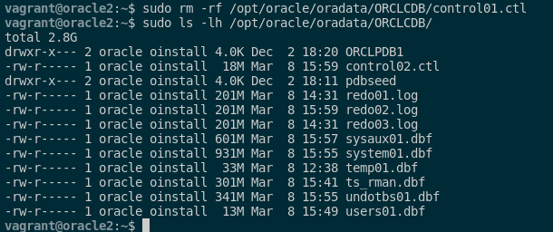
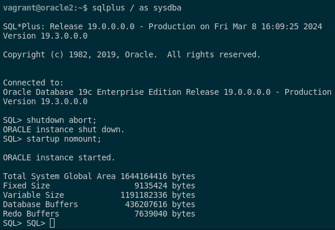
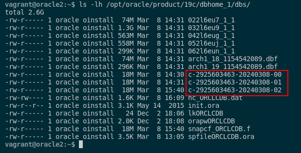
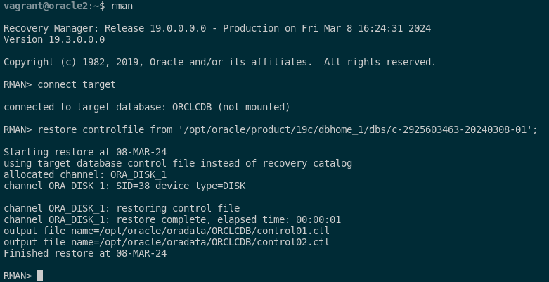
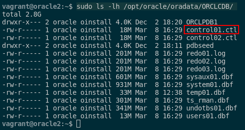

### 5. Borra un fichero de control e intenta recuperar la base de datos a partir de la copia de seguridad creada en el punto anterior.

Para poder borrar un fichero de control e intentar la recuperación de la base de datos a partir de la copia creada mediante RMAN, tendremos que hacer lo siguiente.

Primero, borramos el fichero de control con los siguientes comandos:

```sql
sudo rm -rf /opt/oracle/oradata/ORCLCDB/control01.ctl
sudo ls -lh /opt/oracle/oradata/ORCLCDB/
```



Como podemos ver se ha eliminado correctamente. Seguido de esto accederemos como SYSDBA y forzaremos a que se pare la base de datos y la pondremos en modo no montaje con el siguiente comando:

```sql
sqlplus / as sysdba

shutdown abort;
startup nomount;
```



Seguido de esto, nos conectaremos a RMAN y restauraremos la base de datos con la copia de seguridad creada. Como ya sabemos, para ver los ficheros de control eliminados que estaban incluidos en la copia de seguridad, tendremos que ejecutar los siguientes comandos:

```sql
rman
connect target
list backup of controlfile;
```


Como podemos ver en esta foto, no tenemos la base de datos montada y por ello no podemos acceder al catalogo de RMA. La solución a esto hacerlo a mano, por ende, tenemos que saberque la ubicación de la copia de seguridad que hemos realizado en RMAN. Esto lo veremos con este comando:

```sql
ls -lh /opt/oracle/product/19c/dbhome_1/dbs/
```



Como podemos ver, los ficheros de la copia de seguridad po RMAN son esos. Por ello, accederemos nuevamente a RMAN y ejecutaremos este comando para restaurarlo:

```sql
rman
connect target
restore controlfile from '/opt/oracle/product/19c/dbhome_1/dbs/c-2925603463-20240308-01';
```



Podemos ver que se ha restaurado de manera correcta el fichero de control eliminado mediante la copia de seguridad con RMAN. Para recuperar la base de datos, la volveremos a montar, haremos un recover y la abriremos reseteando los logs con estos comandos:

```sql
alter database mount;
alter database open resetlogs;
recover database;
```

Podemos ver que se ha restaurado de manera correcta con el siguiente comando:

```sql
sudo ls -lh /opt/oracle/oradata/ORCLCDB/
```



Y con esto, ya tendríamos recuperada la base de datos utilizando los archivos restaurados y los archivos de registro de ArchiveLog.