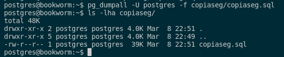
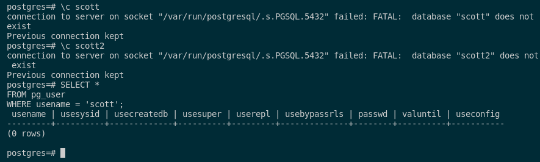
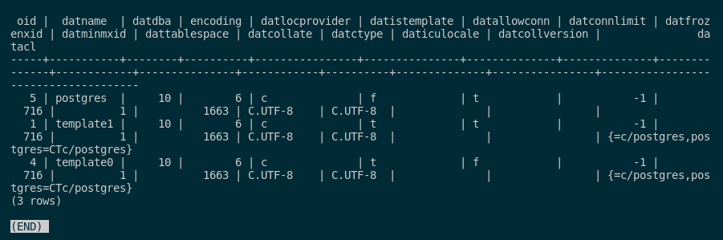
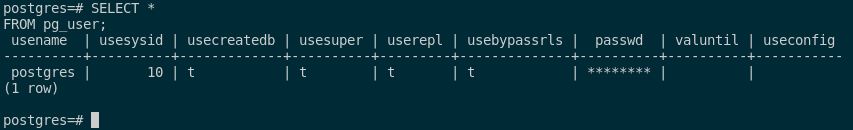
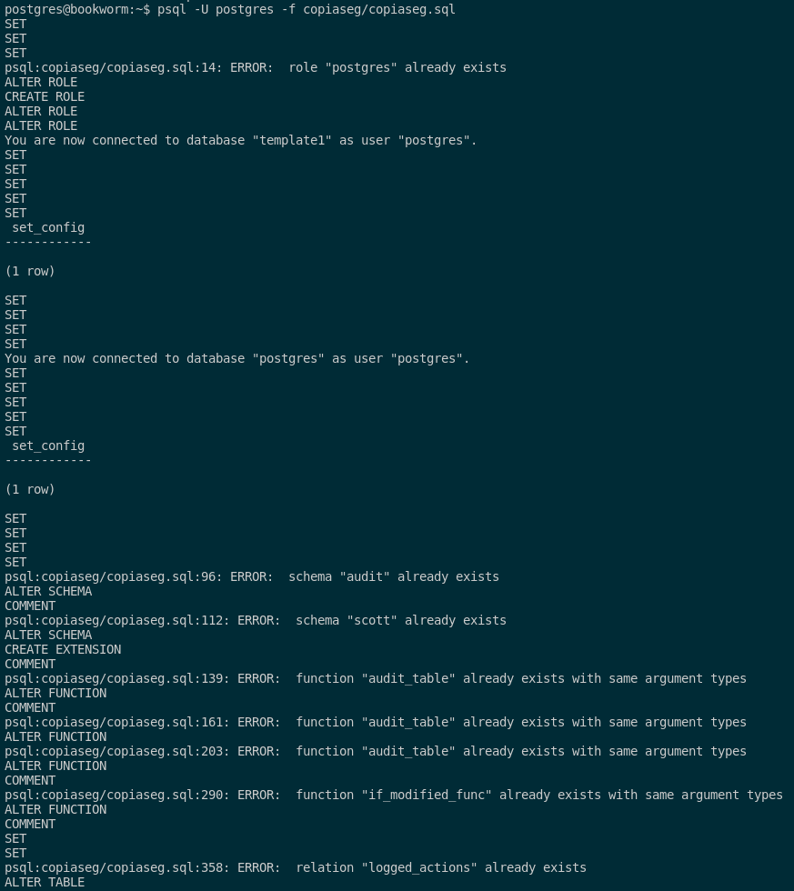
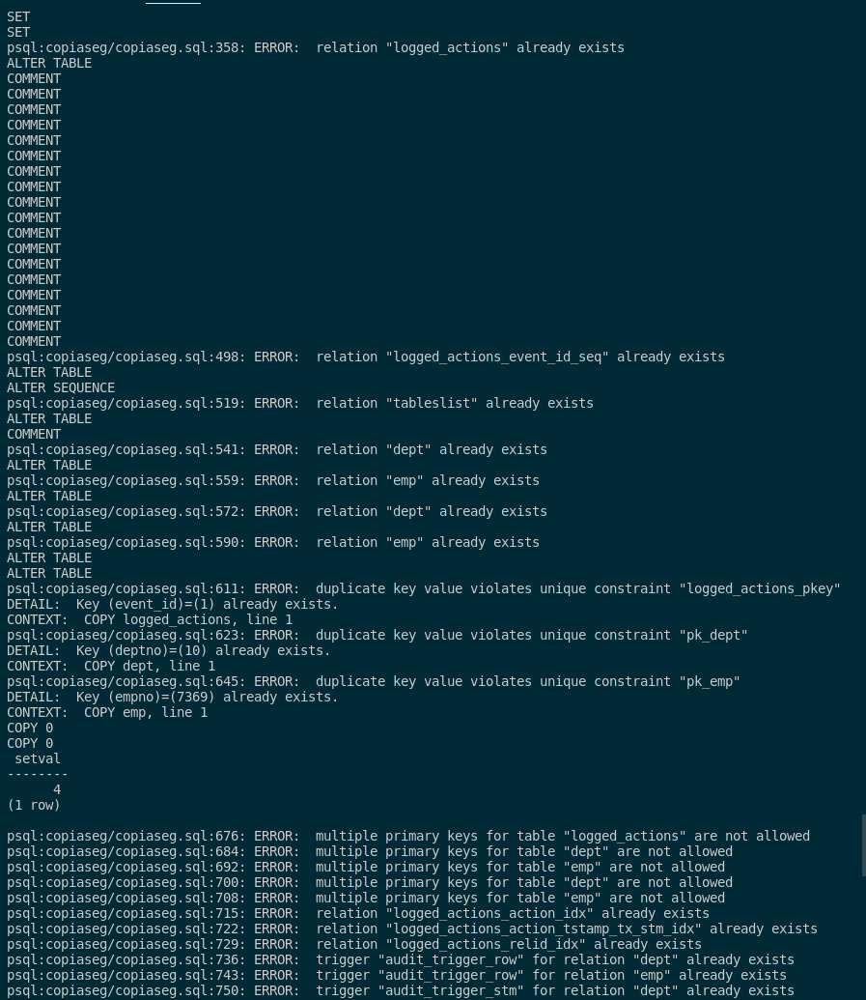
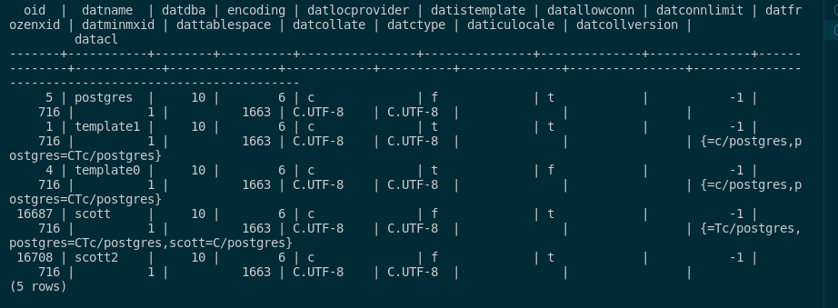
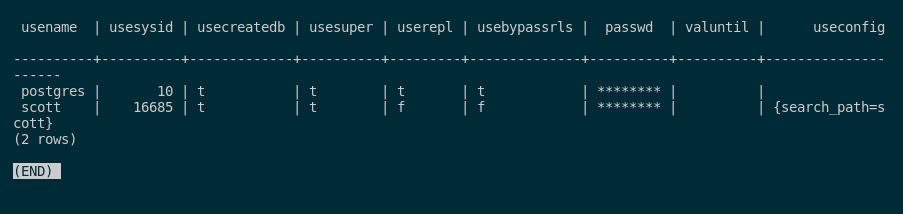
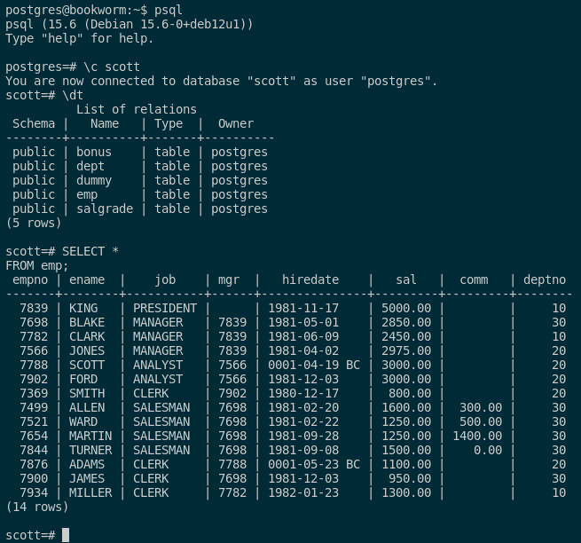

### 6. Documenta el empleo de las herramientas de copia de seguridad y restauración de Postgres.

En PostgreSQL, para poder crear una copia de seguridad de la base de datos, podemos hacerlo usando la herramienta **pg_dumpall**. Esto lo haremos mediante estos comandos que nos crean el directorio donde vamos a exportar la copia de seguridad, el comando para hacer la copia y el comando para ver que se ha creado correctamente:

```sql
mkdir copiaseg
pg_dumpall -U postgres -f copiaseg/copiaseg.sql
ls -lha copiaseg/
```



Para ver el contenido de las sentencias SQL que tiene nuestra copia, tendremos que ejecutar el siguiente comando:

```sql
cat copiaseg/copiaseg.sql
```

Para comprobar que la restauración de la base de datos funciona correctamente, tendremos que eliminar la base de datos y el usuario scott. Esto lo haremos con el siguiente comando:

```sql
psql
DROP DATABASE scott;
DROP DATABASE scott2;
DROP OWNED BY scott;
DROP USER scott;
```

Para comprobar que el usuario scott y sus respectivas bases de datos no existen ya, ejecutaremos estos comandos para verlo:

```sql
SELECT * 
FROM pg_user 
WHERE usename = 'scott';

\c scott
\c scott2
```



Como podemos ver, no existen ya y por ello, si no estamos seguros, podemos ejecutar las siguientes consultas. La primera nos muestra las bases de datos existentes y la segunda nos muestra todos los usuarios:

```sql
SELECT * 
FROM pg_database;
```



```sql
SELECT * 
FROM pg_user;
```



Con esto, ya nos aseguramos que no hay rastros ningunos de scott y sus bases de datos y por ende, pasamos a restaurar la base de datos a partir de la copia de seguridad:

```sql
psql -U postgres -f copiaseg/copiaseg.sql
```





Como podemos obsevar en las capturas, se han insertado los datos que faltaban en la base de datos que hemos eliminado y los que ya existen, se omiten automáticamente.

Por ello, realizamos la misma prueba para ver que se han elimanado para ver si se han restaurado de manera correcta. Los comandos son los siguientes:

```sql
SELECT * 
FROM pg_database;
```



```sql
SELECT * 
FROM pg_user;
```



```sql
\c scott
\dt

SELECT * 
FROM emp;
```



Como podemos ver, la copia de seguridad se ha restaurado de manera completa.