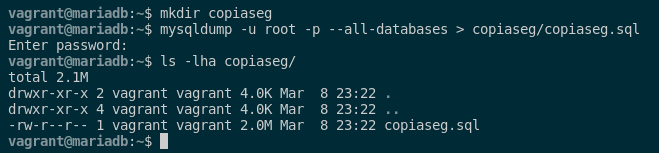
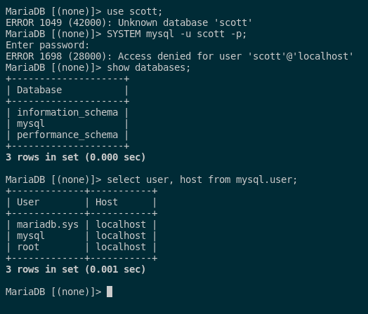
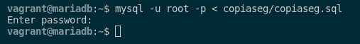
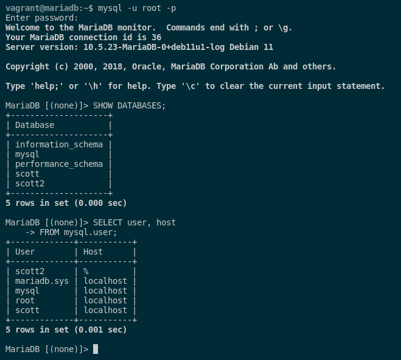
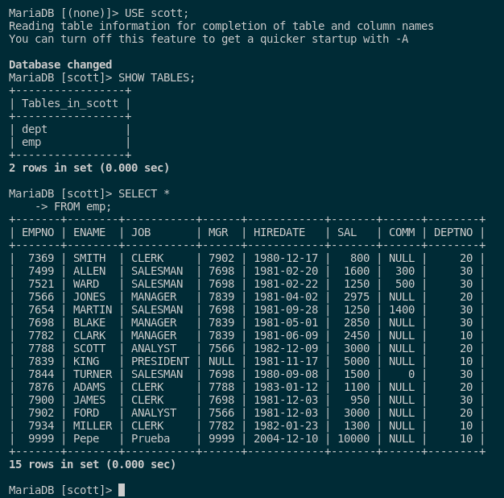

### 7. Documenta el empleo de las herramientas de copia de seguridad y restauración de MySQL.

En MySQL, para realizar una copia de seguridad de la base de datos, podemos hacerlo usando la herramienta **mysqldump**. Esto lo haremos mediante estos comandos que nos crean el directorio donde vamos a exportar la copia de seguridad, el comando para hacer la copia y el comando para ver que se ha creado correctamente:

```sql
mkdir copiaseg
mysqldump -u root -p --all-databases > copiaseg/copiaseg.sql
ls -lha copiaseg/
```



Para ver el contenido de las sentencias SQL que tiene nuestra copia, tendremos que ejecutar el siguiente comando:

```sql
cat copiaseg/copiaseg.sql
```

Para comprobar que la restauración de la base de datos funciona correctamente, tendremos que eliminar la base de datos y el usuario scott. Esto lo haremos con los siguientes comandos:

```sql
mysql -u root -p

DROP USER scott;
DROP DATABASE scott;
DROP USER scott2;
DROP DATABASE scott2;
```

Para comprobar que el usuario scott y sus respectivas bases de datos no existen ya, ejecutaremos estos comandos para verlo:

```sql
USE scott;
SYSTEM mysql -u scott -p;
SHOW DATABASES;

SELECT user, host 
FROM mysql.user;
```



Con esto, ya nos aseguramos que no hay rastros ningunos de scott y sus bases de datos. Pasamos a restaurar la base de datos a partir de la copia de seguridad:

```sql
mysql -u root -p < copiaseg/copiaseg.sql
```



Por ello, realizamos la misma prueba para ver que se han elimanado para ver si se han restaurado de manera correcta. Los comandos son los siguientes:

```sql
mysql -u root -p
SHOW DATABASES;

SELECT user, host 
FROM mysql.user;
```



```sql
USE scott;
SHOW TABLES;

SELECT * 
FROM emp;
```



Como podemos apreciar, la base de datos se ha restaurado correctamente en MySQL.