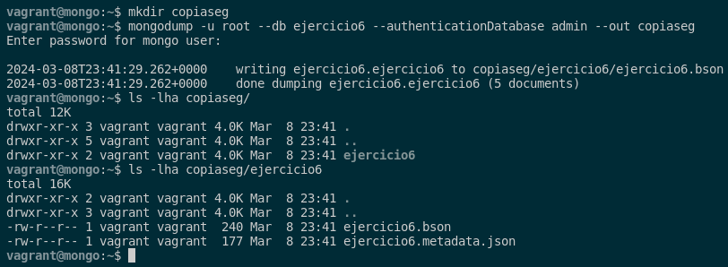
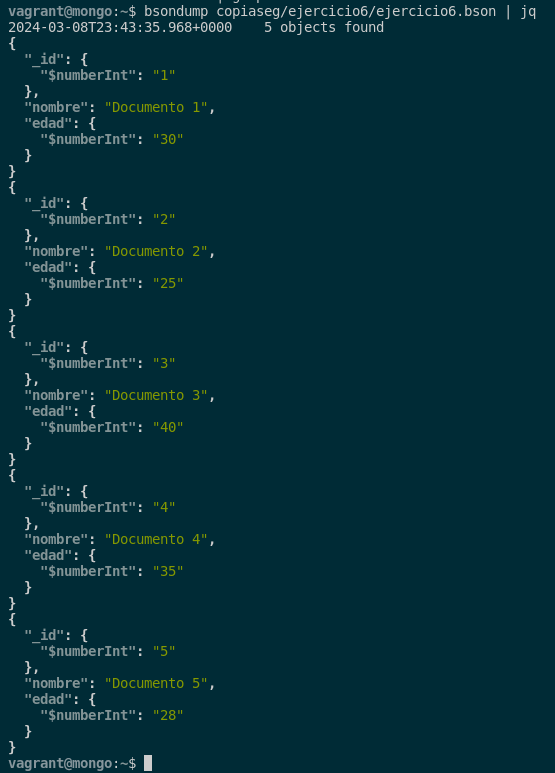
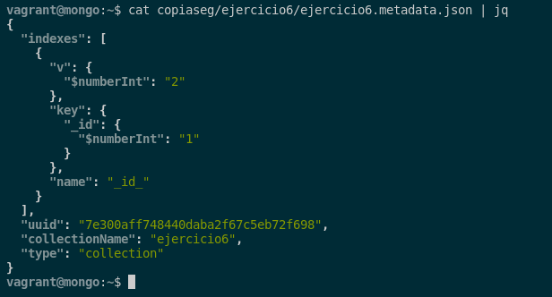
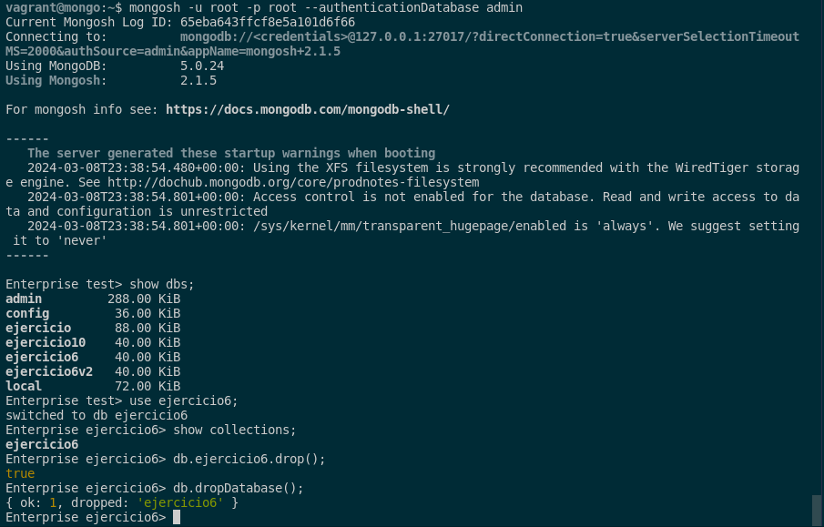
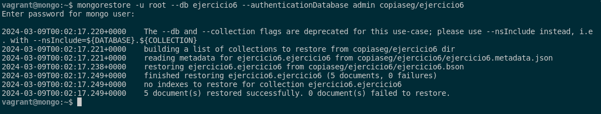
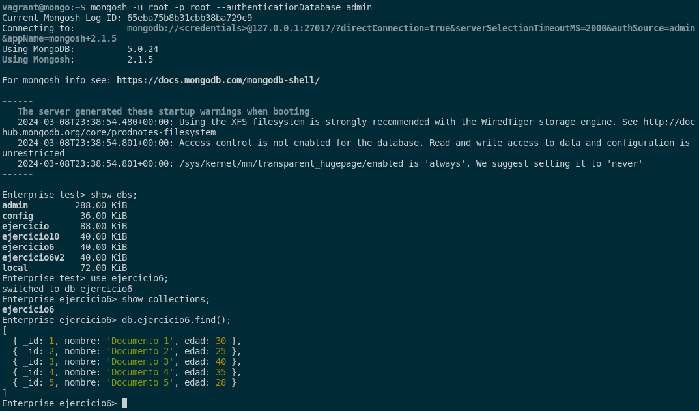

### 8. Documenta el empleo de las herramientas de copia de seguridad y restauración de MongoDB.

En MongoDB, para realizar una copia de seguridad de la base de datos, podemos hacerlo usando la herramienta **mongodump**. Esto lo haremos mediante estos comandos que nos crean el directorio donde vamos a exportar la copia de seguridad, el comando para hacer la copia y el comando para ver que se ha creado correctamente:

```sql
mkdir copiaseg
mongodump -u root --db ejercicio6 --authenticationDatabase admin --out copiaseg
ls -lha copiaseg/
ls -lha copiaseg/ejercicio6
```



Para ver el contenido de las sentencias JSON que tiene nuestra copia, tendremos que ejecutar el siguiente comando:

```sql
bsondump copiaseg/ejercicio6/ejercicio6.bson | jq 
```



```sql
cat copiaseg/ejercicio6/ejercicio6.metadata.json | jq 
```



Para comprobar que la restauración de la base de datos funciona correctamente, tendremos que eliminar la base de datos ejercicio6 y sus colecciones. Esto lo haremos con los siguientes comandos:

```sql
mongosh -u root -p root --authenticationDatabase admin
show dbs;
use ejercicio6;
show collections;
db.ejercicio6.drop();
db.dropDatabase();
```



Con esto, ya nos aseguramos que no hay rastros ningunos de ninguna base de datos y sus respectivas colecciones. Pasamos a restaurar la base de datos a partir de la copia de seguridad:

```sql
mongorestore -u root --db ejercicio6 --authenticationDatabase admin copiaseg/ejercicio6
```



Por ello, realizamos la misma prueba para ver que se han elimanado para ver si se han restaurado de manera correcta. Los comandos son los siguientes:

```sql
mongosh -u root -p root --authenticationDatabase admin
show dbs;
use ejercicio6;
show collections;
db.ejercicio6.find();
```



Como podemos apreciar, la base de datos se ha restaurado correctamente en MongoDB.